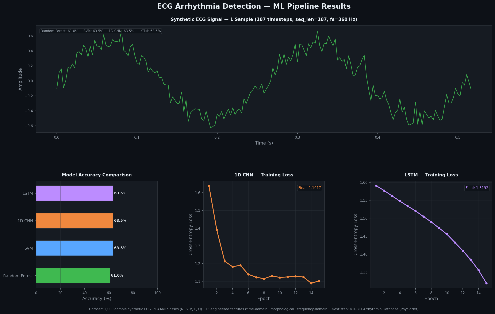

# ECG Arrhythmia Detection — ML Pipeline

A machine learning pipeline that classifies cardiac arrhythmias into **5 AAMI-standard categories** from ECG time-series data.

**Stack:** Python · PyTorch · scikit-learn · NumPy · Pandas · SciPy · Matplotlib

---

## Pipeline Results



> ECG signal strip · model accuracy comparison · CNN & LSTM training loss curves.
> Generated automatically on every `python train.py` run.

---

## AAMI Class Definitions

| Class | Label | Description |
|-------|-------|-------------|
| N | Normal | Normal sinus rhythm |
| S | Supraventricular | Premature atrial/junctional beats |
| V | Ventricular | Premature ventricular contractions |
| F | Fusion | Fusion of normal + ventricular beats |
| Q | Unknown | Pacemaker / unclassifiable beats |

---

## Architecture

```
train.py      ← Main pipeline: data gen · feature extraction · training · results chart
models.py     ← PyTorch architectures (1D CNN · LSTM)
features.py   ← 13 hand-engineered features (time-domain · morphological · frequency-domain)
requirements.txt
results/
  results.png ← Auto-generated on each run
```

### Feature Engineering (13 features)

| Domain | Features |
|--------|----------|
| Time-domain (4) | mean_amp, std_amp, variance, ptp_amplitude |
| Morphological (5) | num_peaks, max_r_peak_amp, min_r_peak_amp, rr_mean, rr_std |
| Frequency-domain (4) | psd_mean, psd_std, dominant_freq, spectral_entropy |

### Models Compared

| Model | Type | Library |
|-------|------|---------|
| Random Forest | Traditional ML | scikit-learn |
| SVM (RBF kernel) | Traditional ML | scikit-learn |
| 1D CNN | Deep Learning | PyTorch |
| LSTM | Deep Learning | PyTorch |

---

## Quick Start

```bash
# 1. Clone and set up
git clone https://github.com/dabhiram13/ECG-Arrhythmia-Detection-System.git
cd ECG-Arrhythmia-Detection-System

# 2. Create virtual environment
python3 -m venv venv
source venv/bin/activate        # Windows: venv\Scripts\activate

# 3. Install dependencies
pip install -r requirements.txt

# 4. Run the full pipeline
python train.py
```

**Output:** terminal results + `results/results.png` generated automatically.

---

## Next Steps — MIT-BIH Evaluation

Current `train.py` uses a 1,000-sample synthetic generator to validate the pipeline end-to-end.
To run the planned clinically realistic evaluation:

1. Install `wfdb`:
   ```bash
   pip install wfdb
   ```

2. Download the MIT-BIH Arrhythmia Database from [PhysioNet](https://physionet.org/content/mitdb/1.0.0/).

3. Replace `generate_synthetic_dataset()` in `train.py` with a `wfdb`-based loader:
   ```python
   import wfdb
   record     = wfdb.rdrecord('mitdb/100')
   annotation = wfdb.rdann('mitdb/100', 'atr')
   ```

---

## References

- [MIT-BIH Arrhythmia Database — PhysioNet](https://physionet.org/content/mitdb/1.0.0/)
- [AAMI EC57 Standard for Arrhythmia Annotation](https://www.aami.org/)
- [PyTorch Documentation](https://pytorch.org/docs/)
- [scikit-learn Documentation](https://scikit-learn.org/stable/)
