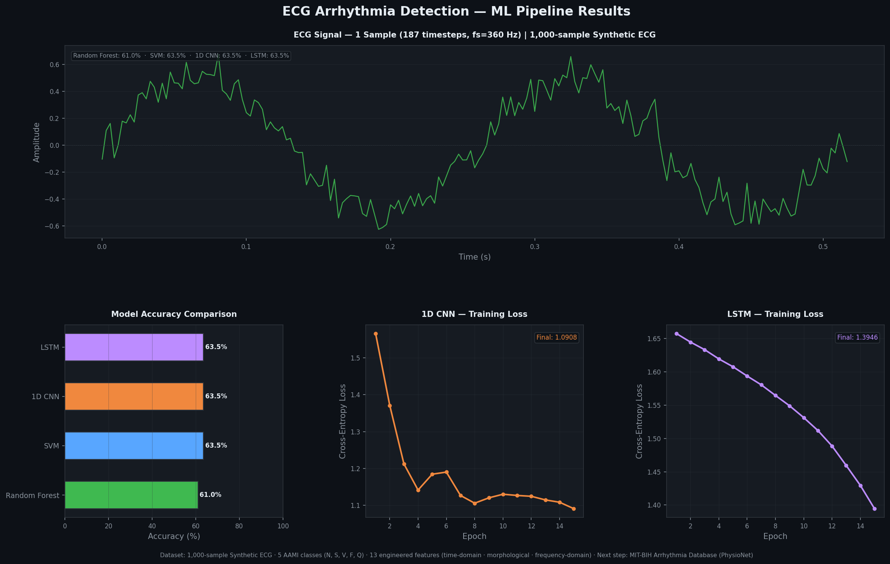
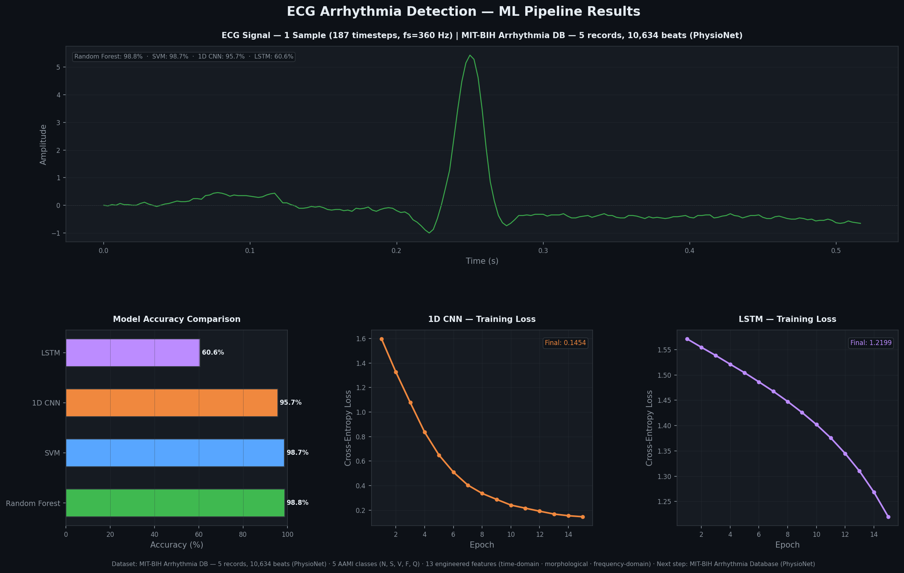

# ECG Arrhythmia Detection — ML Pipeline

A machine learning pipeline that classifies cardiac arrhythmias into **5 AAMI-standard categories** from ECG time-series data.

**Stack:** Python · PyTorch · scikit-learn · NumPy · Pandas · SciPy · Matplotlib

---

## Results — Synthetic Dataset (1,000 samples)

> Pipeline validation on 1,000 synthetic ECG samples. Sinusoid + noise signals,
> labels drawn with class weights matching real MIT-BIH imbalance.



| Model | Accuracy |
|-------|----------|
| Random Forest | 61.00% |
| SVM | 63.50% |
| 1D CNN | 63.50% |
| LSTM | 63.50% |

> **Note on accuracy:** The synthetic dataset is class-imbalanced (N class ≈ 63%).
> Models predicting "Normal" every time would already hit 63% — this is expected
> baseline behaviour on synthetic data. Real data results below are significantly stronger.

---

## Results — Real MIT-BIH Data (PhysioNet)

> Same pipeline, same 4 models, swapped to real clinical ECG recordings from the
> [MIT-BIH Arrhythmia Database](https://physionet.org/content/mitdb/1.0.0/).
> 5 patient records · 10,634 annotated heartbeats · 360 Hz sampling rate.



| Model | Accuracy |
|-------|----------|
| Random Forest | **98.82%** |
| SVM | **98.73%** |
| 1D CNN | **95.67%** |
| LSTM | 60.55% |

> **LSTM note:** 15 epochs is sufficient for 1,000 synthetic samples but underfits
> on 10,634 real beats. More epochs or mini-batch training would close the gap.
> The CNN loss curve shows strong convergence — dropping from 1.60 → 0.15.

---

## AAMI Class Definitions

| Class | Label | Description |
|-------|-------|-------------|
| N | Normal | Normal sinus rhythm |
| S | Supraventricular | Premature atrial/junctional beats |
| V | Ventricular | Premature ventricular contractions |
| F | Fusion | Fusion of normal + ventricular beats |
| Q | Unknown | Pacemaker / unclassifiable beats |

---

## Architecture

```
train.py          ← Full pipeline: data · features · training · charts
mitbih_loader.py  ← Downloads + parses MIT-BIH from PhysioNet (wfdb)
models.py         ← PyTorch: 1D CNN + LSTM
features.py       ← 13 hand-engineered features (NumPy + SciPy)
requirements.txt  ← All dependencies
results/
  results_synthetic.png  ← Auto-generated: synthetic run
  results_real.png       ← Auto-generated: real MIT-BIH run
```

### Feature Engineering (13 features)

| Domain | Features |
|--------|----------|
| Time-domain (4) | mean_amp, std_amp, variance, ptp_amplitude |
| Morphological (5) | num_peaks, max_r_peak_amp, min_r_peak_amp, rr_mean, rr_std |
| Frequency-domain (4) | psd_mean, psd_std, dominant_freq, spectral_entropy |

### Models Compared

| Model | Type | Library |
|-------|------|---------|
| Random Forest | Traditional ML | scikit-learn |
| SVM (RBF kernel) | Traditional ML | scikit-learn |
| 1D CNN | Deep Learning | PyTorch |
| LSTM | Deep Learning | PyTorch |

---

## Quick Start

```bash
# 1. Clone
git clone https://github.com/dabhiram13/ECG-Arrhythmia-Detection-System.git
cd ECG-Arrhythmia-Detection-System

# 2. Virtual environment
python3 -m venv venv
source venv/bin/activate        # Windows: venv\Scripts\activate

# 3. Install dependencies
pip install -r requirements.txt

# 4. Run — trains all 4 models on both datasets, saves both charts
python train.py

# 5. View charts
open results/results_synthetic.png
open results/results_real.png
```

> MIT-BIH data (~110 MB) is auto-downloaded from PhysioNet on first run via `wfdb`.
> Subsequent runs skip the download.

---

## References

- [MIT-BIH Arrhythmia Database — PhysioNet](https://physionet.org/content/mitdb/1.0.0/)
- [AAMI EC57 Standard for Arrhythmia Annotation](https://www.aami.org/)
- [PyTorch Documentation](https://pytorch.org/docs/)
- [scikit-learn Documentation](https://scikit-learn.org/stable/)
